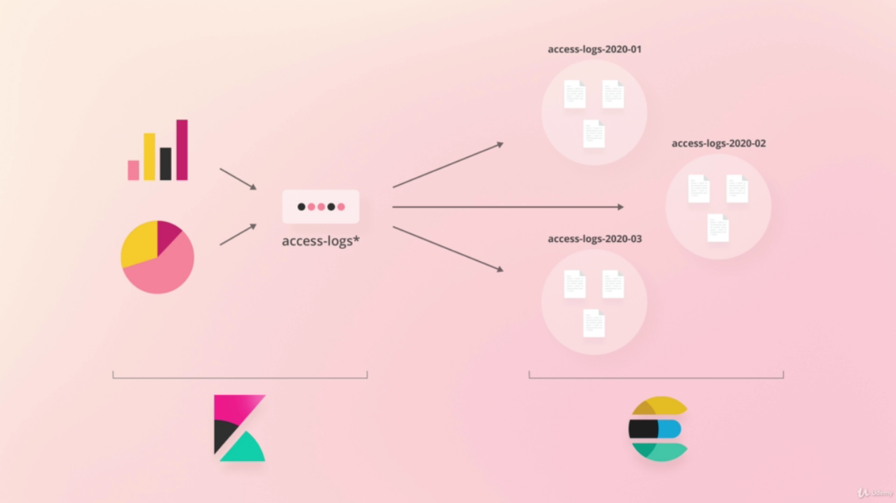

# Introduction

Kibana is an opensource interface used to visualize Elasticsearch data, allowing to build dashboards, visualization, graphs and more over.


On Kibana it is possible:

- `Create Live Dashboards`
- `Dashboards based on Users, Roles & Privileges`
- `Export & Share Data`
- `Create Alerts - Email, Slack and Webhooks`

## Installing Kibana
---

- `Running as a Service` - https://info.elastic.co/elasticsearch-service-trial-course.html

- `Linux`
  - `ElasticSearch` - https://www.elastic.co/downloads/elasticsearch
  - `Kibana` -  https://www.elastic.co/downloads/kibana

## Adding Data
---

The data used in this study is located on the [data folder](./data), and can be imported through the following commands:

```bash
curl -H "Content-Type: application/x-ndjson" -XPOST -u <username>:<password> <elastic-search-endpoint>/_bulk --data-binary "@data/orders.bulk.ndjson"

curl -H "Content-Type: application/x-ndjson" -XPOST -u <username>:<password> <elastic-search-endpoint>/_bulk --data-binary "@data/nginx-access-logs-2020-01.bulk.ndjson"

curl -H "Content-Type: application/x-ndjson" -XPOST -u <username>:<password> <elastic-search-endpoint>/_bulk --data-binary "@data/nginx-access-logs-2020-02.bulk.ndjson"

curl -H "Content-Type: application/x-ndjson" -XPOST -u <username>:<password> <elastic-search-endpoint>/_bulk --data-binary "@data/nginx-access-logs-2020-03.bulk.ndjson"

```

## Index Patterns
---

Index patterns tell Kibana which Elasticsearch indices to query in order to build the visualizations.



- Creating Index Patterns
```bash
1 - Go to Kibana 
2 - Open Stack Management
3 - Index Pattern under Kibana Group
4 - Create new Index Pattern
5 - Enter the index Pattern  #`access-logs*`
6 - Specify the time field Kibana should use to filter data # @timestamp
```

## Important
---

- Kibana has limited support for the nested datatype