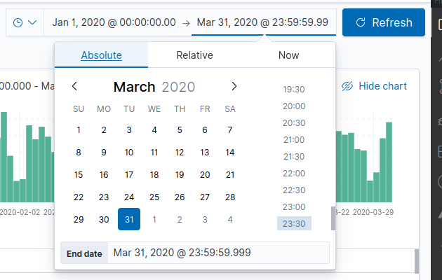

# Introduction to Interface

## Kibana Apps
---
Everything in Kibana is an app, even the start menu. So, Kibana is shipped by default with the following apps:

- `Discover` - Playground to run hot queries against the data. 

- `Visualize` - Where visualization is built, like graph, pie charts, line charts etc.

- `Dashbord` - Where dashboards are build, configurated and managed. A dashboard is a orchestration of visualizations.

- `Canvas` - Basically is dashboard on "steroids", allows much more control over the presentation and visualization of the data. Data will be automatically updated. 

- `Maps` -  Special type of data visualization, where data is ploted on a map.

- `Machine Learning` - Where machine learn can be configured to detect annomalies or a unsual spike. Also, it is possible to forecast future values based on the historical data.

- `Graph` - Interface to visualize connection with your data.

## Elastic Search Apps
---

- `App Search` - Allows to build search mechanisms super quickly and easily with a user interface.

- `Workplace Search` - Allow to search on popular plataforms like Dropbox, One Drive, SharePoint, Github etc. This unifies the search on all entities configured.

## Observability Apps
---

- `Metrics` - Allows to monitoring infrastructure data like CPU, Memory, Latency etc. Much used with `Metric Beat`.

- `Logs` - Allows to monitoring infrastructure logs. Much used with `File Beat`.

- `APM` - Application Performance Management, monitories how a given application performes. Collects information about errors and how often they occur. Also collects https request information like response time, errors, requests etc.

- `Uptime` - Monitores how often application or services are available. Uses "Heart Beat"

## Security
---

Gettings data about security like sockets, ports, hosts, network etc.

## Management

- `Dev Tools` - Allows to run queries against elasticsearch, analyse performance queries, test painless scripts and much more.

- `Stack Monitoring` - Allows to monitoring Elastisearch stack like kibana, logstack, beats e much more.

- `Stack Management` - Exposes interfaces to manage the elastic stack

---
> -x-
---

## Time Filter
---

Kibana allows to specify data ranges when dealing with maps, for that reason it is always necessary to define the data field in the dataset. The time filter is used in globally in many apps.

