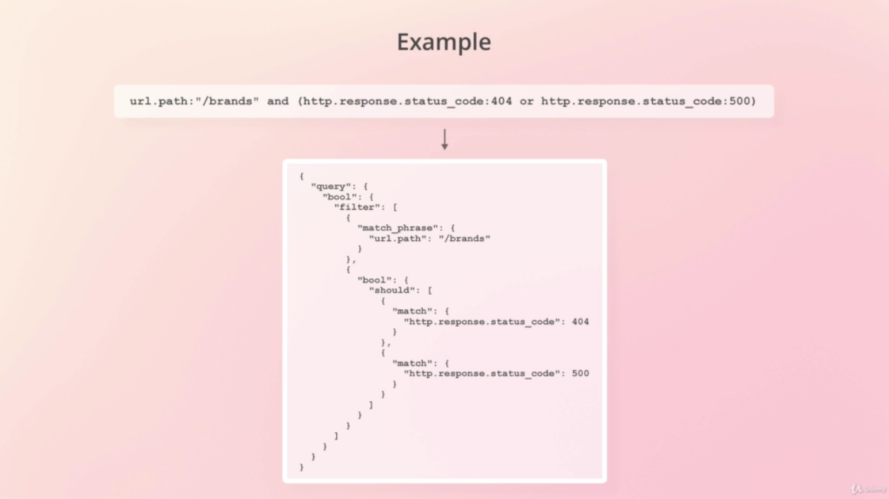

# Kibana Query Language (KQL)
---

Kibana utilizes the KQL to perform queries and build their dashbords. Under the hook Kibana translate the KQL query to Elasticsearch query that is quite verbose



- `Free Text Search`
```bash

#Kibana
products fischer

#Elastic
{
  "query": {
    "bool": {
      "filter": [
        "multi_match": {
          "type": "best_fields"
          "query": "products fischer"
          "lenient": true
        }
      ]
    }
  }
}

```

- `Free Text Search - Phrase`
```bash

#Kibana
"products fischer"

#Elastic
{
  "query": {
    "bool": {
      "filter": [
        "multi_match": {
          "type": "phrase"
          "query": "products fischer"
          "lenient": true
        }
      ]
    }
  }
}

```

- `Field Level Searches`
```bash

#Kibana
# <field_name><operator><value>
http.response.status_code:404

#Elastic
{
  "query": {
    "match": {
      "http.response.status_code": 404 
    }
  }
}

#Kibana
# <field_name><operator><value>
user_agent.original.text:mozilla

#Elastic
{
  "query": {
    "match": {
      "user_agent.original.text": "mozilla"
    }
  }
}

```

- `Range Operators`
```bash

#Kibana
# <field_name><operator><value>
http.response.status_code < 300

#Elastic
{
  "query": {
    "range": {
      "http.response.status_code": {
        "lt": 300
      }
    }
  }
}

#Kibana
# <field_name><operator><value>
"hour_of_day" >= 18

#Elastic
{
  "query": {
    "range": {
      "hour_of_day": {
        "gte": 18
      }
    }
  }
}

```

- `Boolean Operators`
```bash

#Kibana
# <field_name><operator><value> and <field_name><operator><value>
http.response.status_code >= 200 and http.response.status_code < 300

#Elastic
{
  "query": {
    "bool": {
      "filters": [
         "range": {
           "http.response.status_code": { "gte": 200 }
         },
         "range": {
           "http.response.status_code": { "lt": 300 }
         }, 
      ]
    }
  }
}

#Kibana
# <field_name><operator><value> or <field_name><operator><value>
http.response.status_code:404 or http.response.status_code:500

#Elastic
{
  "query": {
    "bool": {
      "should": [
         "match": {
           "http.response.status_code": 404
         },
         "match": {
           "http.response.status_code": 500
         }, 
      ]
    }
  }
}

```

- `Boolean Operators Short Syntax`
```bash

#Kibana
# <field_name><operator>(<value> and|or <value>)
http.response.status_code:(404 or 500 )


#Elastic
{
  "query": {
    "bool": {
      "should": [
         "match": {
           "http.response.status_code": 404
         },
         "match": {
           "http.response.status_code": 500
         }, 
      ]
    }
  }
}

```

- `Boolean Operators - Grouping`

This is how it is possible to define precedence between boolean operations. Using ( )
```bash

#Kibana
url.path:"/brands" and ( http.response.status_code:404 or http.response.status_code:500 )


#Elastic
{
  "query": {
    "bool": {
      "filter": [
        "match_phrase": {
          "url.path": "/brands"
        }
      ]
      "should": [
         "match": {
           "http.response.status_code": 404
         },
         "match": {
           "http.response.status_code": 500
         }, 
      ]
    }
  }
}

```

- `Boolean Operators - Inversion`

By using not operator it is possible to invert the logic.
```bash

#Kibana
not http.response.status_code:200

#Elastic
{
  "query": {
    "bool": {
      "must_not": [
         "match": {
           "http.response.status_code": 200
         }
      ]
    }
  }
}

```

- `Boolean Operators - Group Inversion`

By using not operator it is possible to invert the logic of the entire group.
```bash

#Kibana
not http.response.status_code:200 and not ( url.path:"/brands" or url.path:"/brands/fischer" )

#Elastic
{
  "query": {
    "bool": {
      "must": [
         "match": {
           "http.response.status_code": 200
         }
      ]
      "must_not": [
        "match_phrase": {
          "url.path": "/brands"
        },
        "match_phrase": {
          "url.path": "/brands/fischer"
        },
      ]
    }
  }
}

```

- `Wildcards - Field existence`

```bash

#Kibana
http.request.referrer:*

#Elastic
{
  "query": {
    "exists": {
      "field": "http.request.referrer"
    }
  }
}

```

```bash

#Kibana
url.path:/brands*

#Elastic
{
  "query": {
    "query_string": {
      "fields": [
        "url.path"
      ],
      "query": "\\/brands*"
    }
  }
}

```

- `Wildcards - Searching Multiple fields`

```bash

#Kibana
user_agent.original*:mozilla

```

## Utils

- [Kibana KQL](https://www.elastic.co/guide/en/kibana/current/kuery-query.html)
