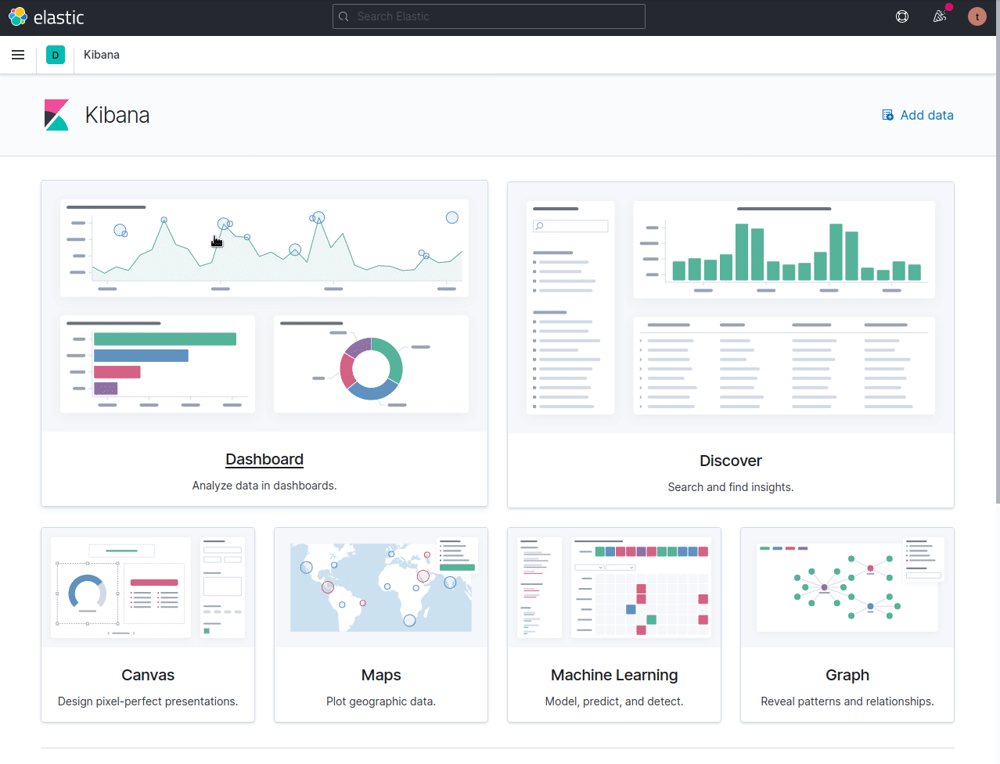
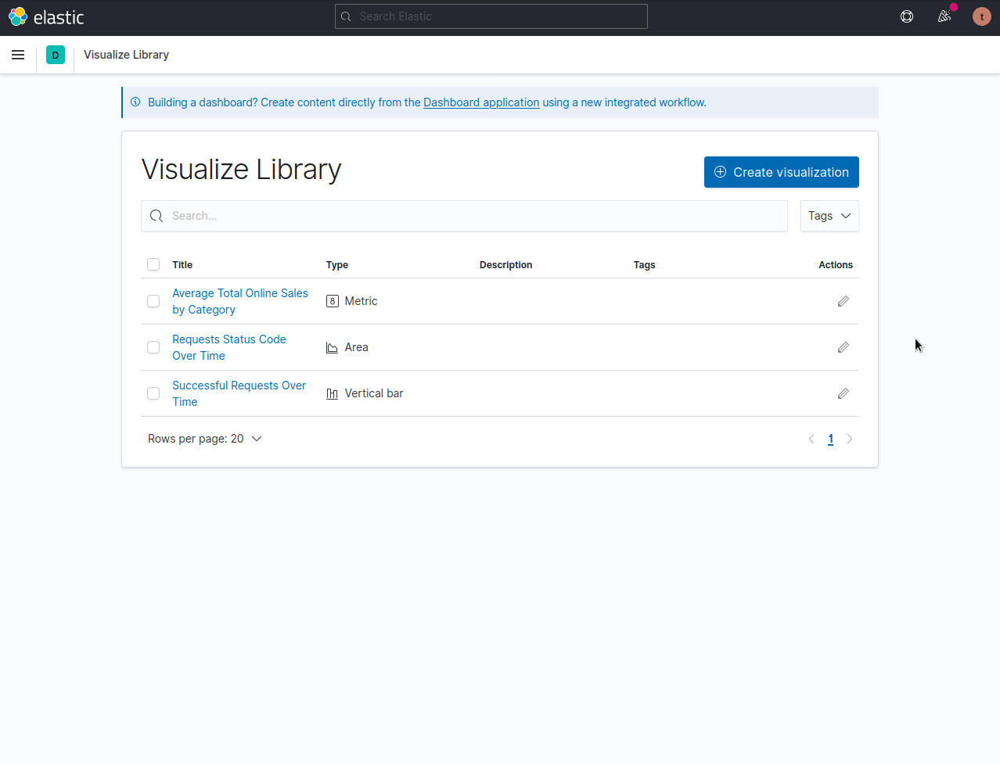

# Visualizations

Kibanas enables to create a series of visualizations, tables, heat maps, pie charts, line charts and more.

## Metric
---

## Formating Numbers
---

## Vertical Bar Visualization
---

## Area Visualization
---

## Line Visualization
---

## Pie Visualization
---

## Visualization With KQL Filters
---

## Visualization With Ranges
---

## Histogram Visualization
---

## Data Table Visualization
---

## Heat Visualization
---

## Cloud Tags Visualization
---

## Goal / Gauge Visualization
---

