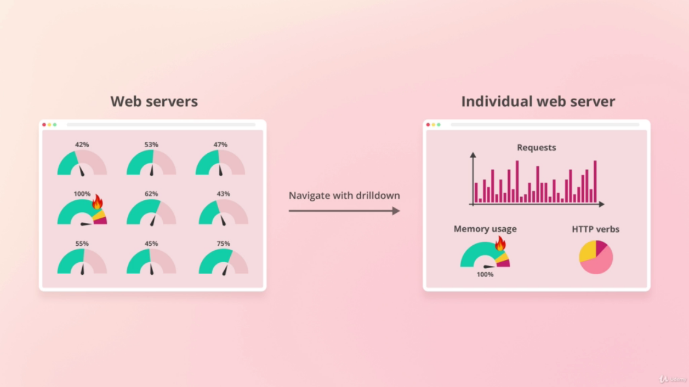
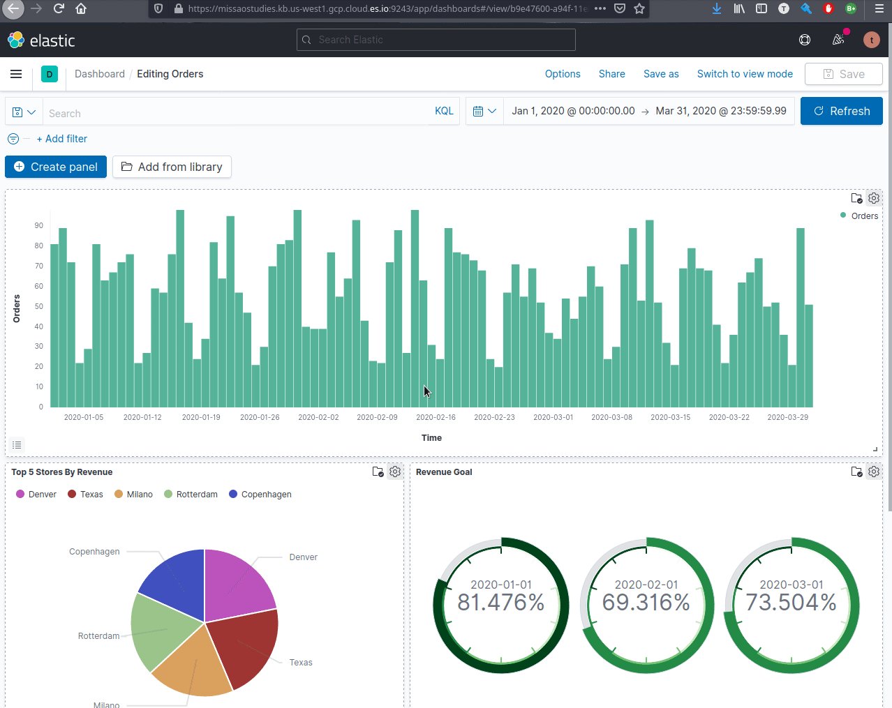

# Dashboard

Dashboards are orchestration of visualizations, usually display data that are related (from the same data source)

Dashboards are often designed with their users in mind.

## Drilldown
---

Drilldown is a way to navigate from one dashboard to another retaining the context.

- `Creating a Drilldown`

