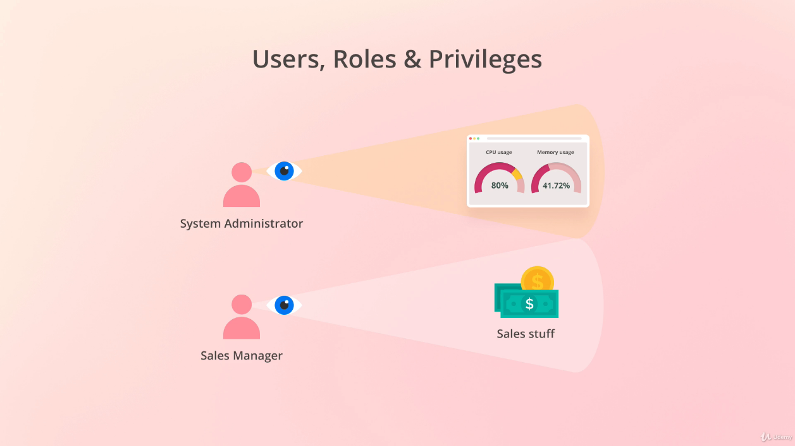
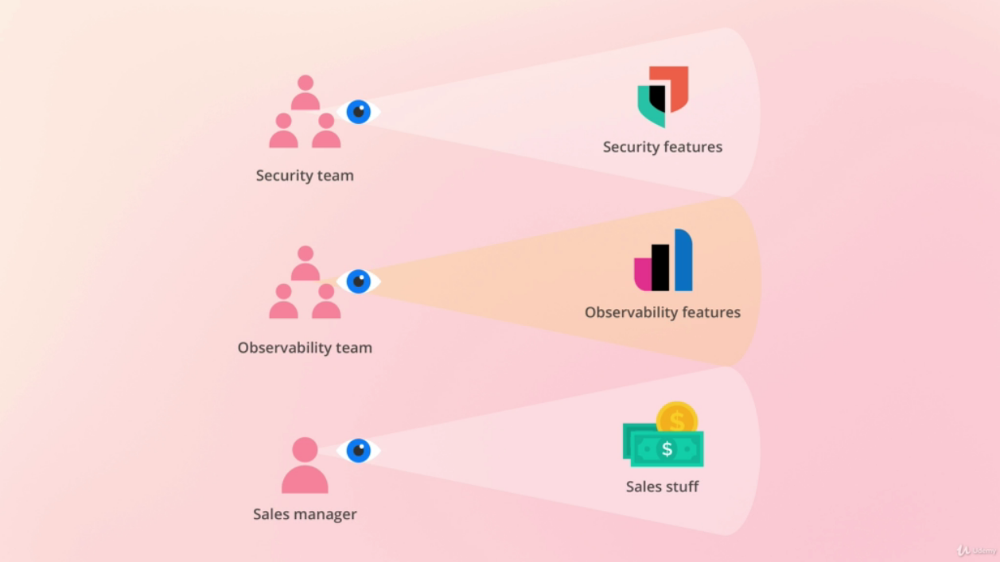
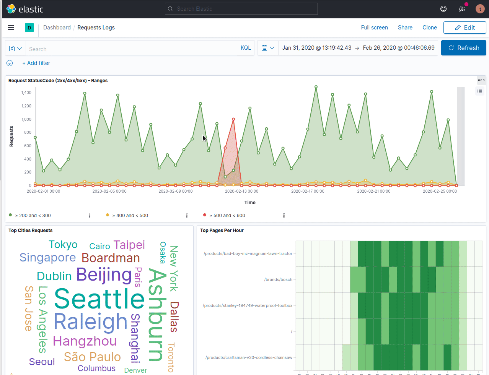

# Users, Roles and Privileges

Kibanas has a security feature that allows to control what each type of user can see.

## Spaces
---

Spaces is a way to control each features are visible and to organize saved objects (Dashboards, Visualizations, Index Patterns, etc).

For example: It is possible to have two spaces: `Developers` and `Business`, and at the space "Business" maybe it is a good idea to disable the development tools.

- `Creating Spaces`

- `Copyng Objects Between Namespaces`

## Roles
---

Allow users to performs action inside Elastic Stack 